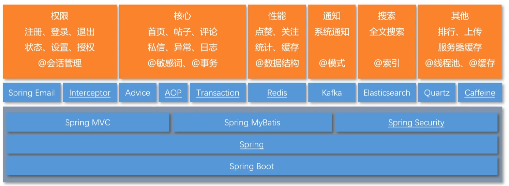
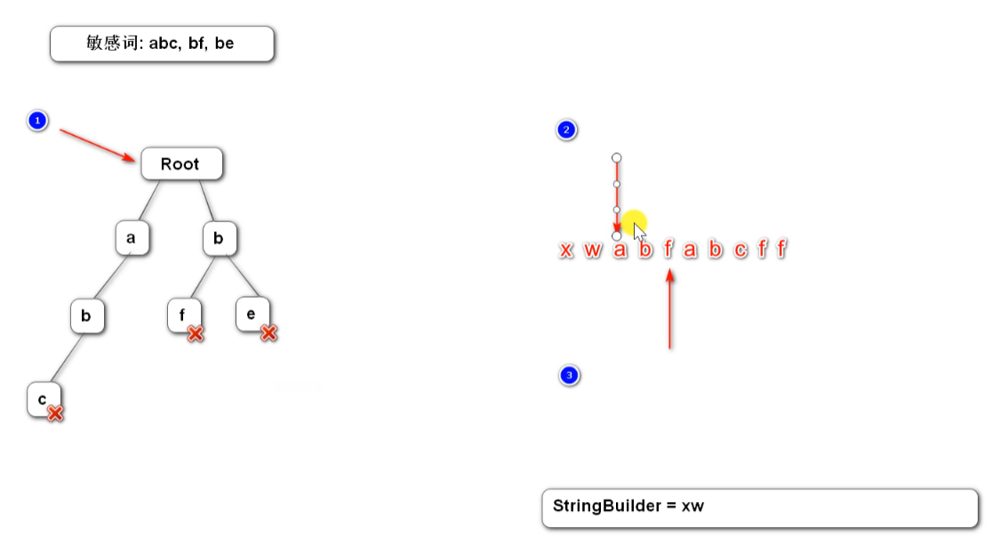

# 仿牛客论坛项目

## 技术栈


<span style="color:orange;">Spring Boot, Spring, Spring MVC, Spring MyBatis, Spring Security, </span>

<span style="color:red;">Spring Email, Interceptor(权限：注册、登录、退出、状态、设置、授权 ，@会话管理)</span>,

<span style="color:green;">Advice, AOP, Transaction(核心：首页、帖子、评论、私信、异常、日志，@敏感词、@事务)</span>，

<span style="color:blue;">Redis(核心：首页、帖子、评论、私信、异常、日志，@数据结构)</span>,

<span style="color:red;">Kafka(通知、系统通知，@模式)</span>，

<span style="color:green;">Elasticsearch(搜索，全文搜索 @索引)</span>，

<span style="color:blue;">Quartz, Caffenine(排行、上传、服务器缓存，@线程池，@缓存)</span>,


### 事务管理
- 通过Spring的声明式事务管理器实现了数据的一致性和完整性。
- 配置并使用了Spring的DataSourceTransactionManager作为默认的事务管理器。
- 使用注解驱动的方式定义和管理事务边界，保证了多个并发请求的数据一致性。

### 过滤敏感词

使用前缀树过滤敏感词



### Redis的使用
#### 单点登录
- 使用Redis作为缓存中间件，将用户Token存储在Redis中，实现了会话的持久化存储和跨服务的共享访问。
- 使用Token验证机制确保用户身份的安全性，减少对数据库的频繁查询操作，提高系统性能和响应速度。
- 实现了会话单点登录功能，当用户在一个服务中登录后，其他服务可以通过Redis缓存中的Token验证用户身份，避免了重复登录和频繁的身份验证过程。
#### 帖子点赞和关注功能。
- 使用Redis作为缓存中间件，将帖子的点赞数和用户的关注关系存储在Redis中，提高了查询速度和系统响应性能。
-  实现了帖子点赞功能，用户可以对帖子进行点赞操作，通过Redis的计数功能实时更新帖子的点赞数，并根据需要进行排行榜展示。
-  实现了用户关注功能，用户可以关注其他用户或感兴趣的帖子，关注关系存储在Redis的集合中，实现了快速的关注列表查询和推送通知功能。 

#### 统计UV和DAU

### Kafka的使用

### 热帖排行

把有过变动的（点赞评论加精）帖子id存入redis，

每隔5分钟（Quartz）把这些id拿出来，从mysql中拿出帖子，对帖子热度进行计算

缓存

```
if (userId == 0 && orderMode == 1) {
    return postListCache.get(offset + ":" + limit);
}
```

Caffeine

就是一个key，value缓存主要通过load方法将数据放到缓存，失效时间是3分钟，热帖刷新是5分钟

本地缓存Caffeine缓存，提高数据的访问速度，使用Jmeter进行负载测试，并通过调优系统参数和代码逻辑，将访问吞吐量提高了10倍。

